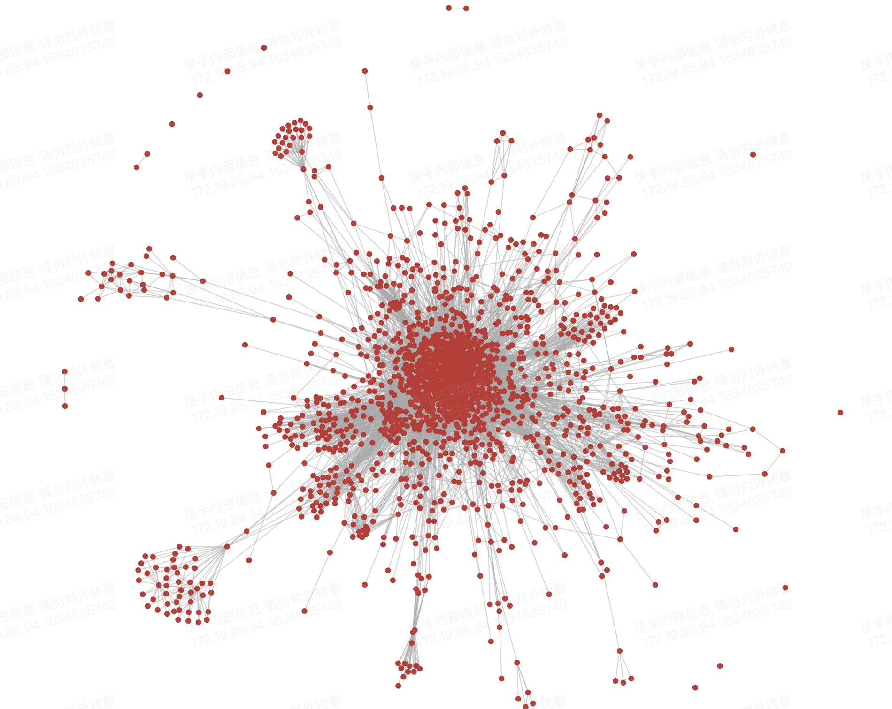

# 组件结构

我们在谈组件化的时候，很多时候我们会谈到“拆库”。以 iOS 为例，我们会使用使用 CocoaPods 拆为一个个的 Pod，然后再通过 Podfile 组装起来。而组件化中的拆库，实际上在谈一个事情“隔离”。

1. 如何划分不同物料的边界，最好这些边界是清晰的。
2. 如何做到业务和业务之间的隔离
3. 如何让业务自己独立的发版和迭代节奏
4. 如果进行有效的分层，让业务开发能够不用关注底层的变动。

所以这里面会牵扯到两个问题：

* 组件内部的结构是什么样子的
* 组件之间的结构是什么样子的

接下来我们将会分两部分阐述这两种结构。组件内部结构将会从前面讲到到组件定义中对齐下来。虽然，看起来我们需要首先说清楚一个组件长什么样子，然后再去讲一群组件在一起是什么样子。 但是，往往在做组件化这个事情的时候，我们首先会关注到的是组件间的结构。 所以我们会优先讨论组件间结构。 是

## 组件间结构

最开始的时候， 我们的工程是“单体工程”。一个工程文件， 然后加上一堆的代码。 大概也就是我们的工程了。但是，当代码规模变大后。就会发现， 单体工程的可维护性会逐渐变差。 好一点的，可能会拆一下目录。这里说的目录还是 IDE 里面的目录结构。拿 iOS 来说 XCode 里面的目录结构，与文件系统中的目录结构是不一致的。然后，就会引发一个非常尴尬的问题，基本上代码是无法 CodeReview 的。 因为无法通过 CodeReview 单子中的目录结构，知道这个代码是干嘛的。这是维护性降低的一个例子。&#x20;

于是我们就开始“拆库”。那按照什么规则拆分呢？简单来说：纵向分层，横向正交。&#x20;

组件间的结构，其实是一个非常复杂的结构。我们可以先看一个复杂应用实际的组件之间的依赖情况：

形如这种组件之间的依赖关系组成的拓扑结构，我们可以理解成是组件之间的物理结构。但是，很明显，这个图的可阅读性已经是非常差。1500+的组件，其关系错综复杂。这个结构其实在我们进行**架构设计**的时候，能够给我们提供的信息是有限的。他主要是在进行组件治理阶段，我们关注具体的组件A与组件B之间的关系的时候，会有作用。于是我们为了能够方便我们理解组件间结构关系，我们一般会创建一种逻辑结构。在工程实践中，我们称这种弄结构为**分层架构**。

所谓纵向分层，即是我们通过分层架构，对我们工程域中的组件进行归类。 一般我们的分层依据是与业务的亲和度。换句话说，就是离我们真实业务的距离。&#x20;

们在讨论组件间的结构的时候，一方面是在讨论这种物理结构，另外一方面我们也在讨论组件的逻辑结构。而在更多的时候时候，我们讨论的是分层架构这种逻辑结构。因为一个层次清晰的架构图，更能够辅助我们来设计/理解我们的系统。接下来，我们先花点时间集中讨论一下如何在组件化的场景下实施分层架构。对于组件的物理结构部分，会放在组件治理话题下展开讨论。

### 纵向分层

分层是一个非常自然的选择。当组件数量增多的时候，我们会习惯将具有相同特性的组件进行归类。比如我们会将一些想网络库、Logger库、外部引入的一些 UI 组件放到一个层次；会将我们的类似于社交业务的组件、登录页面所在的组件等放到一个层次。仔细去看，我们把他们聚类在一个层次的重要原因是他们与业务的亲和度，亲和度这个指标主要是说组件内部含有业务逻辑的浓度。我们这里所说的业务，就是我们需要构建的真实的业务场景。比如登录吧，直接写用户登录的那部分代码，我们可以认为是业务亲和度非常高。而像网络库这样主要是支撑我们去做完用户登录的代码，我们会认为他的业务亲和度较低。

我们通过把不同业务亲和度的组件聚类之后，就能够自然的得到一个分层架构。 具体要分多少层，可以根据自己的业务情况，尤其是业务规模决定。例如常见的三层架构：

应用层中我们放我们需要向外交付的最终的应用组件，比较典型的是壳工程。业务层中，我们存放能够承载我们真实业务逻辑的的一些组件，例如承载登录业务的组件、承载设置的组件等等。而基础功能层，放一些用来支撑业务，但是并非我们的业务逻辑的代码，例如通用的网络库，日志库之类。                                                                                                                                                                                                                                                                                                                                                                                                                                                                                                                                                                                                                                                                                                                                                                                                                                                                                                                                                                                                                                                                                                                                                                                                                                                                                                                                                                                                                                                                                                                                                                                                                                                                                                                                                                                                                                                                                                                                                                                                                                                                                                                                                                                                                                                                                                                                                                                                                                                                                                                                                                                                                                                                                                                                                                                                                                                                                                                                                                                                                                                                                                                                                                                                                                                                                                                                                                                                                                                                                                                                                                                                                                                                                                                                                                                                                                                                                                                                                                                                                                                                                                                                                                                                                                                                                                                                                                                                                                                                                                                                                                                                                                                                                                                                                                                                                                                                                                                                                                                                                                                                                                                                                                                                                                                                                                                                                                                                                                                                                                                                                                                                                                                                                                                                                                                                                                                                                                                                                                                                                                                                                                                                                                                                                                                                                                                                                                                                                                                                                                                                                                                                                                                                                                                                                                                                                                                                                                                                                                                                                                                                                                                                                                                                                                                                                                                                                                                                                                                                                                                                                                                                                                                                                                                                                                                                                                                                                                                                                                                                                                                                                                                                                                                                                                                                                                                                                                                                                                                                                                                                                                                                                                                                                                                                                                                                                                                                                                                                                                                                                                                                                                                                                                                                                                                                                                                                                                                                                                                                                                                                                                                                                                                                                                                                                                                                                                                                                                                                                                                                                                                                                                                                                                                                                                                                                                                                                                                                                                                                                                                                                                                                                                                                                                                                                                                                                                                                                                                                                                                                                                                                                                                                                                              &#x20;

### 横向正交

当我们进行了分层之后，会很自然的问一个问题。就是在同层内， 如何进行组件拆分。这里给出的答案是：职责正交(横向正交)。拆分的目标是组件与组件之间不存在职责重叠。例如日志库与网络库不存在职责重叠，所以两个要单独拆解。

## 组件内部结构

### 组件组成要素

一如我们在开始就讨论的问题：什么叫组件？我们给出的答案是：组件，主要是指一簇因可以完成一定的功能聚合在一起的代码、资源、配置文件等组成的一个实体。在这个定义中，我们可以很清晰的看出：看出组件这个实体也是由其他更细粒度的实体组合而成。而这些实体可以分成两类：

* 组件描述文件
* 组件内部资源

组件描述文件，主要负责描述组件的元信息以及组件内部资源的结构和使用方式。在绝大部分的包管理系统中，我们可以见到这个文件。例如 iOS CocoaPods 中的 podspec、ruby gem 中的 gemspec、npm 系统中的 package.json ... 。这个文件基本上是事无巨细的描述了，这个组件是什么，可以做什么用，他是由哪些内部资源组成的。而在一些系统中，甚至描述了组件的构建规则（例如 iOS CocoaPods 和 安卓的 Gradle）。组件描述文件，同时也决定着组件被使用的方式。拿 iOS CocoaPods 来举例，在 podspec 中可以定义使用的是 framework 或者静态库，或者直接是以源码的方式进行集成。

而组件内部资源则比较复杂。会因技术栈的不同，而有差异性。但基本上，也主要分成三类：

* 源代码/二进制产物
* 静态资源，例如图片、视频等
* 配置文件

### 目录结构

目录结构是组件在文件系统中的存储形式。也是我们在开发一个组件的时候，第一眼看到的东西。因而，对于目录结构需要进行一定的设计。使其能够非常清晰直接的表达一个组件的构成。同时，我们也可以将研发过程中的一些流程或者约束固化到目录结构上。

组件，主要是指一簇因可以完成一定的功能聚合在一起的代码、资源、配置文件等组成的一个实体
