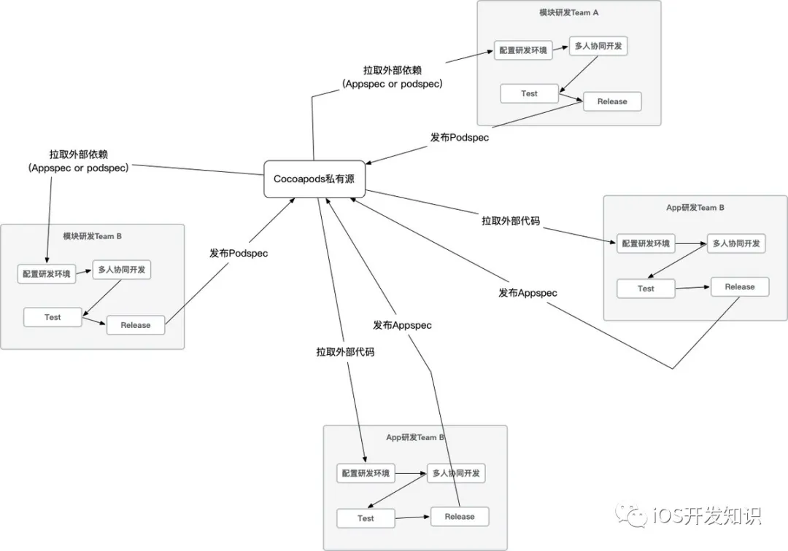

# 孤立开发

### 什么是孤立开发

最近看到 cocoapods 1.7.0.beta 的发布blog，将要引入appspec的概念以推进'Isolated Development'概念。无独有偶，在设计实施我们内部的一个工具的时候，我们也设计了一个'appspec'，从功能和设计概念上，根据其blog中来看是基本上一致的，我们当时设计的目标是：让开发人员能够将关注焦点放到模块上，而非应用层，换句话说就是基于模块研发，而非基于应用研发。而这正好是‘孤立开发’的一个反映。让开发同学关注他们应该关注的东西，帮助他们从信噪比高的嘈杂工程环境中隔离出真正的焦点。

试图定义一下‘孤立开发’。“孤立开发”是一种研发协同模式，这种模式下每位开发同学‘孤立’的开发一个模块，在研发环境，研发流程，研发节奏上与其他研发同学能够有较好的隔离。这里的研发环境并不是简单指IDE等，甚至是对于底层模块的依赖。

### 孤立开发的收益

孤立开发适合大型项目，对于小型项目来讲，是完全没必要这么折腾的。大家同时在一个仓库和工程里面开发就好了。只有工程复杂度上来了，孤立开发才会显现出他的收益。  
而从另一个的角度来讲，得益于cocoapods，每一位iOS开发同学都已经享受过'孤立开发'的好处了。因为几乎每一位iOS开发同学都使用过，第三方库。但是，我们在使用第三方库的时候，我们没有关心过这些库用了什么样的IDE开发的？他们的分支管理策略是什么？他们的开发习惯是什么？他们的代码规范是什么样子的？....他们的MacOS的版本是多少？同样第三方库的开发者，也不会去关心自己的库的使用者的这些问题。而这就是孤立开发好处：让开发同学关注他们应该关注的东西，帮助他们从低信噪比的嘈杂工程环境中隔离出真正的焦点。

### 在协同问题上的孤立开发

> 不一定把研发一个Application全部的上下文都给到每一个研发同学

协同问题的核心是资源或者信息的交换。具化一下研发协同一个较核心的问题是我们如何交换我们的”代码“。git或者svn都是这样解决这个问题的具体的实现。也可以看到，我们在实际的研发过程中，也在大范围的使用这种代码版本管理工具。例如使用git，push自己的修改的代码然后pull别人的代码。在这里进行代码交换的单元是”仓库“。

而在iOS开发中以仓库为单元进行代码交换也是常见的操作，例如cocoapods的默认假设：一个仓库就是一个模块。所以cocoapods在拉取模块的时候，会直接使用git tag或者git commit进行拉取。但是追问一句，我们真的一定要使用git的方式进行交换代码吗？或者我们是否有其他的方式交换?

当然，我们可以使用其他的方式，比如通过http下载，甚至自己写个shell脚本，再通过shell脚本去生成代码都是可以的。git只是其中一种实现形式。

那我们交换的东西是什么？我们刚才说是代码，再追问一下其实我们往往会给这坨代码一个概念，例如：壳工程、模块、组件等等。实际上我们希望交付是一个概念的实体，在cocoapods的假设中这个叫做”模块“或者”pod”。顺着这个逻辑往下想，我们怎么交换一个壳工程，又怎么交换一个工程文件？

然后我们就会发现，我们没有一种比较标准的方式去交付壳工程或者我们的工程文件。然后围绕着这个问题很多同学在尝试不同的方式，例如通过git仓储，然后git分发的方式分发壳工程，例如滴滴使用OneTool直接针对特定的项目特异化处理，然后分发，例如淘宝的摩天轮系统。

那么这里是否存在一种相对比较普遍的方式去交换呢？有的，这就是appspec。Appspec是类似于podspec的一种规格文件，他描述的是壳工程以及工程配置相关的信息，通过appspec可以完整的描述一个iOS工程，不止包括xcworkspace文件生成规则，编译规则，甚至是工具链层次（例如fastlane和swiftlint）的东西。这些东西的配置和工作规则，对于模块研发同学来说应当是透明掉的。而appspec除了能够标准化壳工程之外，也可以作为一种手段让模块开发同学不用去关注壳工程的技术细节。

